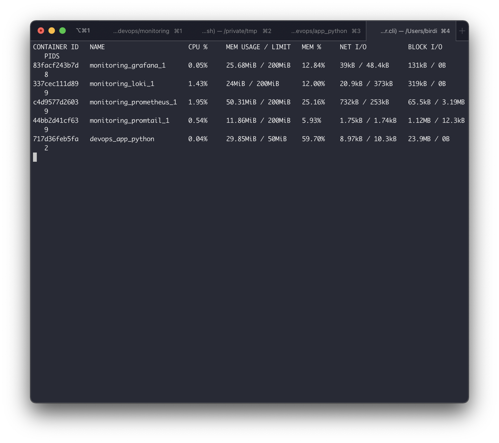

# Logging
## Screenshots

App's whole logging system is configured to put logs into `/tmp/app_python.log` file,
then here is the path
`app container -> VM -> host system -> VM -> promtail container`

## Found bugs

There is an interesting point of doing this lab
on MacOS in particular. The docker actually runs
in the special, vm created by `docker desktop`, and docker mounts only a specified folders to the mentioned
VM.

https://stackoverflow.com/a/48183300/6446389
Also, it doesn't work with `/var/log` dir — because of some `PermissionError` exception

## Best practices
1. Performs log rotate either based on log size or time. Use `RotatingFileHandler` or `TimedRotatingFileHandler`
for this on python
2. Put backups on a `s3` storage or whatever storage
3. Put loki database on `s3` or any other persistent storage. [examples](https://grafana.com/docs/loki/latest/storage/)
4. Use one format consistently, so that it's easy to parse them
5. Use `alert management system`. For instance, if `healthcheck` failed
6. Use [sentry](sentry.io) for errors, as it's easier to analyze the software outcome than the raw logs

# Metrics

Very useful — https://docs.docker.com/config/daemon/prometheus/
https://docs.docker.com/compose/compose-file/compose-file-v2/#extension-fields

Also, while logging is configured for all
services I have in this lab with
docker's `logging` option, it was hard
for me to test it on MacOS. See (Found bugs)[#Found bugs]
section.
But, I've checked them inside the `docker desktop's`
VM with help of [this](https://gist.github.com/BretFisher/5e1a0c7bcca4c735e716abf62afad389)
`docker run -it --rm --privileged --pid=host justincormack/nsenter1`

